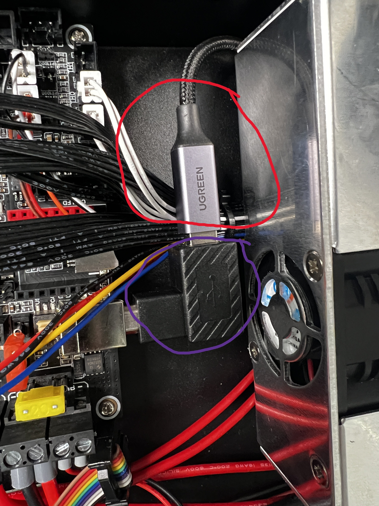

# Installing BTT SKR 3EZ
This is fairly simple process. Additionally, I'm not going to type step by step on wiring, there will be a link to that. If you wired one, its basically the same.

## Step 1: Poweing off
* Turn the power off and disconnect the power cable.

## Step 2: Open the electronics compartment
If you are a visual learner go [here](https://youtu.be/l7mxGVF-QGE?t=86) down below will just be typed stepps.
> **NOTE:** *You can ignore most of this if you plan on flipping your printer.*
* Unplug/ remove SD card
* Optional but reccommended; remove right side stepper motor wire (makes it easier to flip over the electronics enclosure) if you just want to flip your enclosure and not the printer
* Remove the 4 black screws; two in the front and two in the back of the printer.
* Flip over case
* Remove 6 screws holding the bottom to the top.

## Step 3: Remove Stock board
Make sure you take out the MB and not the screen, not being a SA just through as I can be. My visual learners go [here](https://youtu.be/l7mxGVF-QGE?t=171).

* There a 4 screws on the board that needs to be removed (save those screws they will be reused)
* Remove the cables
* Set the board aside (and take a moment of silence for its hard work)

## Step 4: Installing the MB
Almost done! 

* Grab your handy dandy board adapter and you stock MB screws
    > 
    > * Purple: This is where your stock screws holding your MB will go.
    > * Red: this is where your M2.5*6+6 [kit I used](https://amzn.to/3JkD8qF)
* Next up install your MB with M2.5*6 screws 
> **Note:** *MB orientation is with USB facing power supply*

## Installing your cables
This will mostly be the same for everyone. Instead of typing it all out click [here.](https://youtu.be/r9fsRMXb5X0?t=550) He does a really good job of explaining it and why recreate the wheel?
> **NOTE:** *One thing to point out I highly recommend if you're following along with this from my sprite extruder installation double check the ohms on both fan pins to make sure their polarity is correct before plugging it in. Remember don't take the readout as anything except if it's wired correctly you will get some numbers if not then zero.*

> **NOTE:** *If you want the ability to run Z tilz add your second Z cable to the 5th stepper driver port.(E1M)*

* ## **NOTE:** *My extruder didn't work with the way it came. Yours probably won't either since the creality boards extruder pinout show their wire sequence different. Explination below.*

**EOM Pin Sequence on SKR**
|Set 1 |    |Set 2|    |
|:----:|:--:|:---:|:--:|
| 2B   | 2A |  1B | 1A |

> See pinout [here.](../Files/BIGTREETECH%20SKR%203%20EZ%20Pinout.jpg)

**E1 Pin Sequence on Stock 4.2.2 Ender 3 Pro MB**
|Set 1 |    |Set 2|    |
|:----:|:--:|:---:|:--:|
| 2B   | 1B |  1A | 2A |
> * What they were made to go on.
> * See schematic [here.](../Files/Creality%204.2.2%20Schematic-1.png)

* So all that to say do a continuity test and the two that cause your multimeter to beep put them side by side. If you want to be certan test both sets once you swap the two. Doesn't matter which one is **"A"** or **"B"** in the set as long as they are cozy side by side.

> Green: most multimeters continuity test logo should look like this.

* Lastly for instillation is your USB Cable. 

    > **Purple:** I purchased this [left angle adapter](https://amzn.to/3FrYykr).
    
    > **RED:** As well as a much [longer cable](https://amzn.to/3YOFiVd) to be ran out the back

> # Don't close up shop just yet. Need to flash the board before closing up. If you know how to set up klipper then you are good to go from here.

[Klipper-Mainsail Configuration](../Klipper%20&%20.cfgs/Klipper.md)

[Home](../readme.md)

[Top](#installing-btt-skr-3ez)
