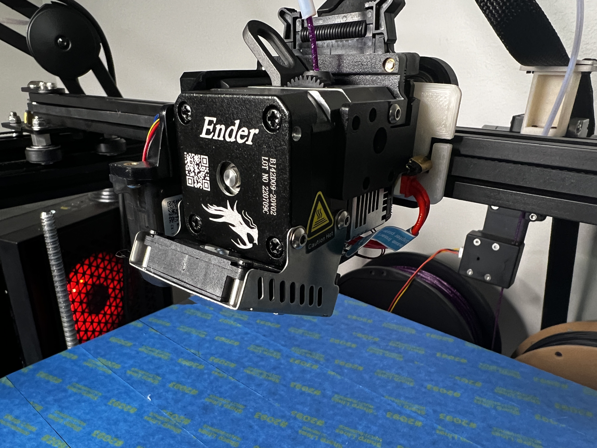
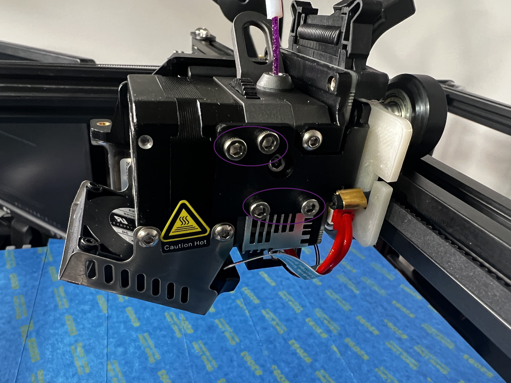

# Installing Sprite Extruder
This is mostly self explanitory, but for the sake of flow I will add this section. For steps 1 and 2 I will not be going into to much detail as you can just reverse the steps you took while assembling your printer. [Manual](https://www.creality.com/pages/download-ender-5-plus) 

> **NOTE:** *MY SPRITE PRO KIT DID NOT COME WITH A CABLE FOR THE BL TOUCH. CHECK YOURS! [The one I purchased.](https://amzn.to/3ZOp1AR)*

> **NOTE:** *I will not be taking pictures or an install guide on the mount itself, but if you're going that route its the same general steps.*

> **NOTE:**  *If you have not printed all of the parts please click [here](Printing%20Sprite%20Extruder%20Parts.md).*

## Step 1: Power
* Verify printer's power is off; unplug if you feel like it

## Step 2: Remove stock hotend
* Remove original hotend. Save all wheel hardware and screws holding hotend to mounting plate. Follow this [video](https://www.youtube.com/watch?v=nbmqpncobn8) if you do not know how to do this.
* Loosen belt tensioner on the left side of the X-axis.
> 

## Step 3 Attach Adapter Plate
* Begin by attaching the Adapter Plate to the mount that comes with the sprite extruder.
>
 > * Purple - reuse screws holding the factory extruder onto original plate. The chamferd holes will be facing away from the extruder plate to make the screws more flush.
 > * Red - This will all be pulled off original 

## Step 4 Attach Sprite Extruder to X-Axis
* Attach Extruder mount to X-Axis

>
 > * Red - I like to connect one side fo the belts before attaching the mount to the rail, you can do both after just, wanted to point this out.
 > * Purple - place both top wheels in the V-slot and insert lower stock bolt and other hardware.
 > * At this time you should adjust the eccentric nut. Ensure the carrage can freely move side to side, but doesn't wiggle(?). 
 > * lastly in this step attach the other side of the belt (or both sides if you waited.)

 ## Step 5
  * Attach Sprite Extruder (ignore my cable my pictures are form after install and testing)
> 
    > * You will know it has attached correctly if it stays put once you (carefully) let it go. You can also wiggle it a little and you'll feel it's slightly "locked" inplace.

> 
    >  * Then attach the 4 bolts that came with the kit. 

[Wiring Extruder](Wiring%20Extruder.md)

[Main](../readme.md)

[Top](#installing-sprite-extruder)

